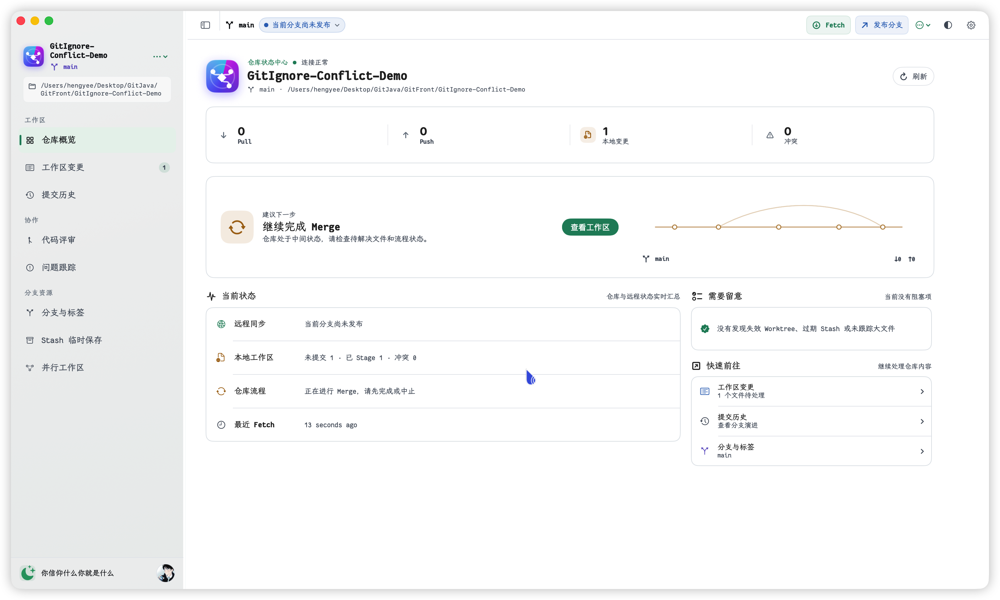
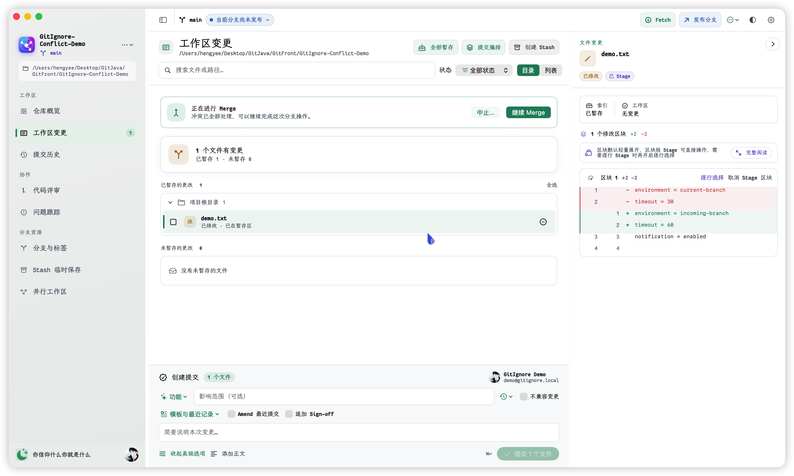
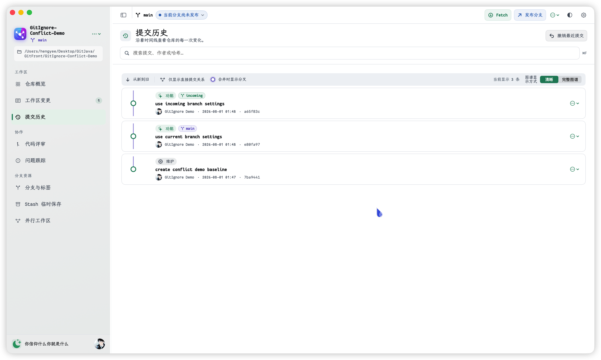
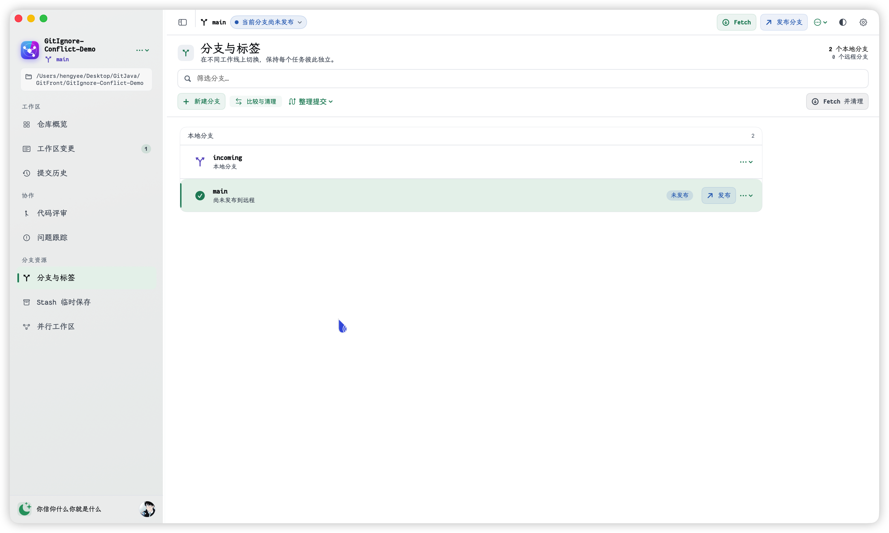
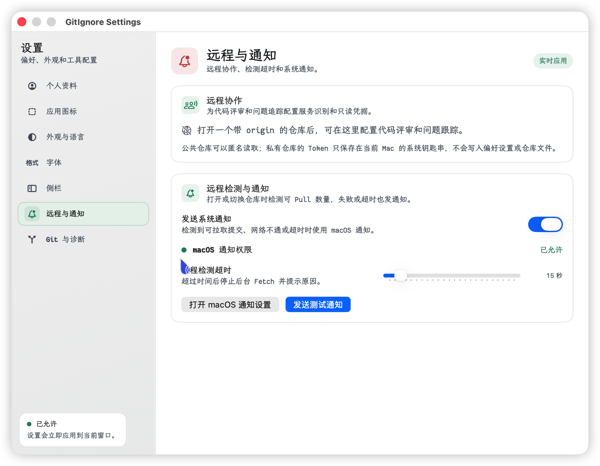
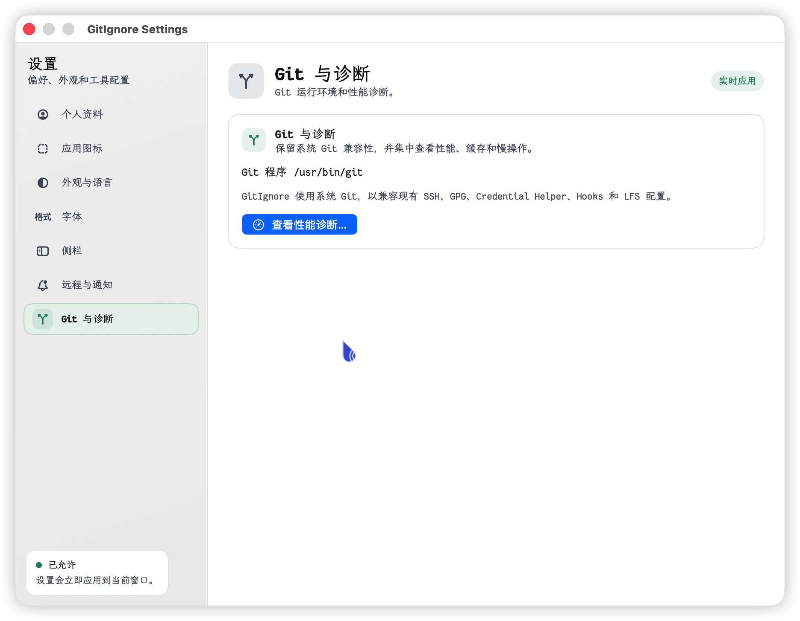

# GitIgnore

> 一款原生 macOS Git 客户端，让仓库状态、提交历史、分支和 Diff 更容易理解。
>
> A native macOS Git client that makes repository state, history, branches, and diffs easier to understand.

[中文](#中文) · [English](#english)


<p align="center">
  
  
</p>

<p align="center">
  
  
</p>

<p align="center">
  
  
  
</p>

<p align="center"><sub>GitIgnore in action · GitIgnore 界面预览</sub></p>

## 中文

GitIgnore 是面向 macOS 的原生 Git 客户端。它把工作区、提交历史、分支、远程状态和 Diff 放在一个稳定的三栏工作流中，同时保留原生 macOS 的键盘操作、深色模式、辅助功能和性能表现。

当前版本为 `v0.1.0-alpha`，欢迎试用和反馈。Alpha 版本不建议作为唯一的生产恢复工具。

### 功能

- 原生 SwiftUI + AppKit 三栏界面
- 支持 Apple Silicon 和 Intel，macOS 14+
- 浅色、深色和跟随系统外观
- 中英文界面，以及独立的中英文字体设置
- 工作区状态、批量 Stage、Unstage、Discard 和提交
- 工作区 Diff、暂存区 Diff、提交详情和三方冲突编辑器
- 本地分支、远程分支、标签、Stash 和 Worktree
- Fetch、Pull、Push，以及新分支首次发布
- Merge、Rebase、Cherry-pick、Revert 和 Reset 工作流
- 远程可 Pull、本地待 Push、冲突和网络状态提示
- Git 操作超时、取消、`index.lock` 预检和性能诊断
- GitHub、GitLab、Gitee 的代码评审与问题追踪入口

### 安装 Release

从 [Releases](https://github.com/hengyee-labs/GitIgnore/releases) 下载最新的 DMG 或 ZIP，拖动 `GitIgnore.app` 到“应用程序”文件夹。当前发布包为未公证的 ad-hoc 签名版本，首次启动时可能需要在 Finder 中右键应用并选择“打开”。

### 从源码构建

环境要求：Xcode 16+、macOS 14+、系统已安装 Git（通常位于 `/usr/bin/git`）。

```bash
git clone https://github.com/hengyee-labs/GitIgnore.git
cd GitIgnore
xcodebuild \
  -project GitIgnore.xcodeproj \
  -scheme GitIgnore \
  -configuration Release \
  -destination 'platform=macOS' \
  -derivedDataPath /tmp/GitIgnoreDerivedData \
  CODE_SIGNING_ALLOWED=NO \
  build
```

构建产物位于 `/tmp/GitIgnoreDerivedData/Build/Products/Release/GitIgnore.app`。工程关闭 App Sandbox，方便个人版访问任意本地仓库并调用系统 Git；正式分发前需要重新评估安全书签、Hardened Runtime、Developer ID 和 Notarization。

### 隐私与安全

Git 操作由本机 Git CLI 执行，GitIgnore 不上传仓库文件内容，也不包含遥测服务。GitHub、GitLab、Gitee Token 只保存在 macOS 系统钥匙串中。请不要在 Issue、Discussion、日志或诊断信息中提交 Token、密码、私钥、内部仓库地址或完整认证 URL，安全问题请参阅 [SECURITY.md](SECURITY.md)。

### 性能回归

```bash
zsh Tools/performance-fixtures.sh all
zsh Tools/performance-regression.sh --scenario all --report /tmp/gitignore-performance.json
```

应用内“设置 → Git → 性能诊断”会记录 Git 进程、输出解析、状态应用、Diff 解析、刷新和仓库切换阶段。

### 路线图

- 更完整的行内和并排 Diff 引擎
- 大型提交历史的虚拟化和筛选
- 更完整的三方冲突编辑器
- Sparkle 或 GitHub Releases 更新中心
- Developer ID 签名与 Notarization 发布流程

### 参与贡献

请先阅读 [CONTRIBUTING.md](CONTRIBUTING.md)。提交 PR 前至少执行一次 Release 构建，并说明影响的页面、Git 操作、性能风险和手动验证步骤。

## English

GitIgnore is a native macOS Git client for understanding repository state, commit history, branches, remotes, and diffs in one calm three-column workflow. It supports native macOS keyboard interaction, appearance modes, accessibility, and performance-conscious loading.

The current release is `v0.1.0-alpha`. Feedback and contributions are welcome; Alpha builds should not be your only production recovery tool.

### Features

- Native SwiftUI + AppKit three-column interface
- macOS 14+, Apple Silicon and Intel
- Light, dark, and system appearance
- Chinese and English UI with separate CJK and Latin font choices
- Workspace status, batch Stage, Unstage, Discard, and commits
- Workspace, staged, and commit diffs with a three-way conflict editor
- Local and remote branches, tags, Stashes, and Worktrees
- Fetch, Pull, Push, and first publication for new branches
- Merge, Rebase, Cherry-pick, Revert, and Reset workflows
- Incoming, outgoing, conflict, and network status indicators
- Git timeout/cancellation, `index.lock` preflight, and performance diagnostics
- Code review and issue tracking entry points for GitHub, GitLab, and Gitee

### Install a release

Download the latest DMG or ZIP from [Releases](https://github.com/hengyee-labs/GitIgnore/releases), then move `GitIgnore.app` to Applications. Releases are currently ad-hoc signed and not notarized; macOS may require Finder → right-click → Open on first launch.

### Build from source

Requirements: Xcode 16+, macOS 14+, and Git installed on the system (usually `/usr/bin/git`). Use the build command shown in the Chinese section above, or open `GitIgnore.xcodeproj` in Xcode and run the `GitIgnore` scheme.

### Privacy and security

Git operations run through the local Git CLI. GitIgnore does not upload repository contents and includes no telemetry service. GitHub, GitLab, and Gitee tokens are stored in the macOS Keychain. Do not include tokens, passwords, private keys, internal repository paths, or complete credential URLs in public reports. See [SECURITY.md](SECURITY.md) for security reports.

### Contributing and license

See [CONTRIBUTING.md](CONTRIBUTING.md) before opening a pull request. GitIgnore is released under the [MIT License](LICENSE).
